# Ubuntu server
## Datos personales
- Nombre: Antonio Jesús Mora Cabeza
- Curso: 1º DAW A
- Asignatura: Sistemas Informáticos
- Correo: nmorcab2106@g.educaand.es
- Iniciales: AJMC

## Datos del servidor
- 2 nucleos
- 2048 MB de memoria
- 100GB de memoria

## Configuración de particiones
En la pestaña de Storage Configuration, se eligió poder configurar las particiones y luego se crearon las particiones:
- / con 20G
- /home con 76GB
- swap con 3G es decir la ram por 1.5 (2x1.5)

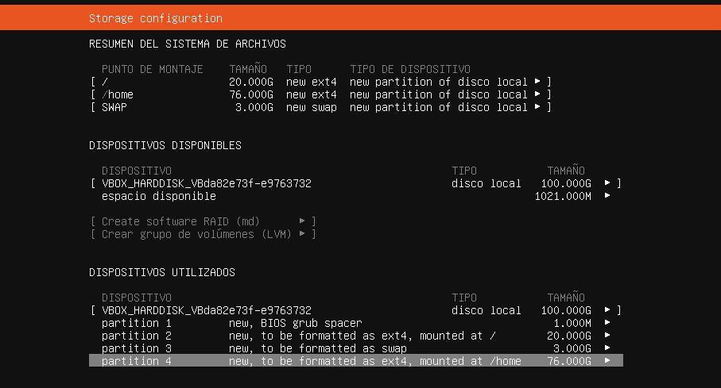

## Instalación de SSH
Ponemos el siguiente comando para instalar SSH y cuando lo pida pondremos S.
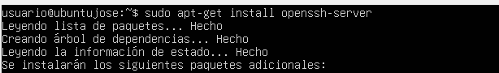

Ahora comprobaremos que se ha instalado
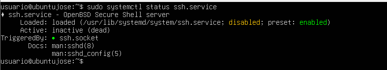

Y lo activaremos
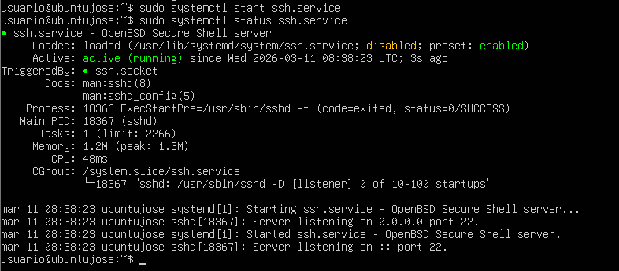

Luego para que siempre se inicie pondremos lo siguiente
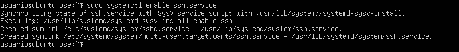

Luego pondremos lo siguiente para que no haya problemas con el firewall
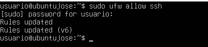

## Instalacion de Apache
Pondremos el siguiente comando para instalar apache
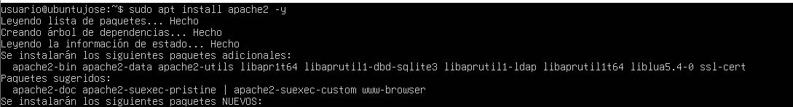

Una vez instalado, pondremos lo siguiente para comprobar que se ha instalado correctamente
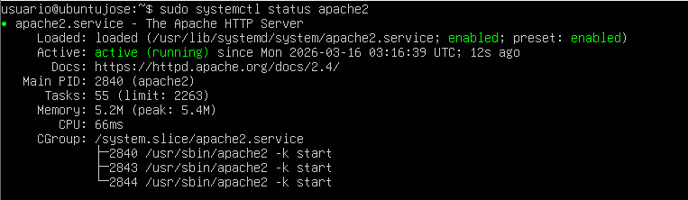

En caso de que no esté activo pondremos el siguiente comando
```
sudo systemctl start apache2
```

Y para que se inicie siempre, pondremos lo siguiente
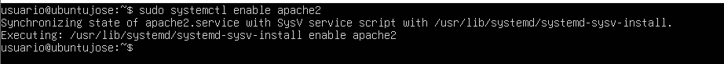

Desde el navegador, podremos acceder a la página mediante la ip, en mi caso, 192.168.1.160
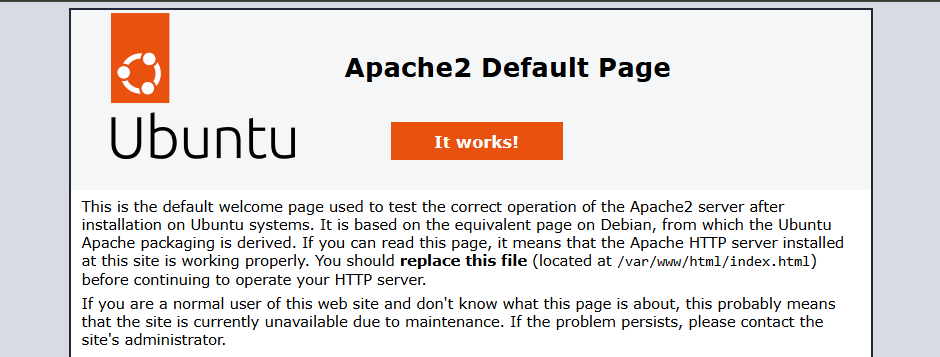

## Instalación de FTP
Se instalará vsftpd con el siguiente comando
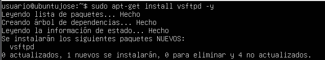

Ahora comprobaremos que el servicio funciona
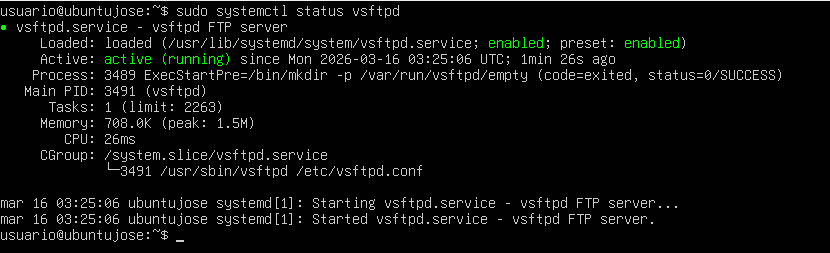

En caso de estar inactivo pondremos lo siguiente
```
sudo systemctl start vsftpd
```

Para que siempre se inicie pondremos lo siguiente
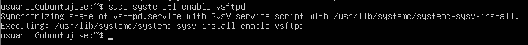

Ahora crearemos el usuario FTP
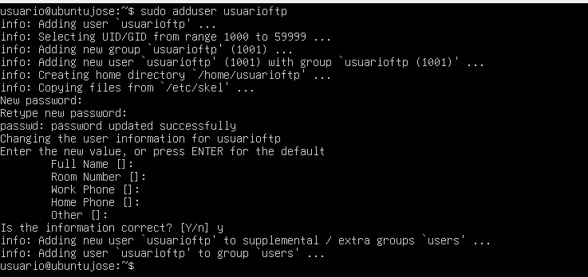

Luego configuraremos FTP, abriendo el archivo /etc/vsftpd.conf (podremos añadir o modificar las líneas)


Además, añadimos la siguiente línea al final del documento
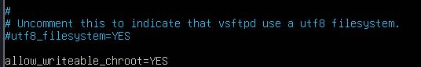

Y luego de guardarlo reiniciaremos el servicio


Como estoy en windows, para conectarme al servidor usaré filezilla. El puerto será el 21
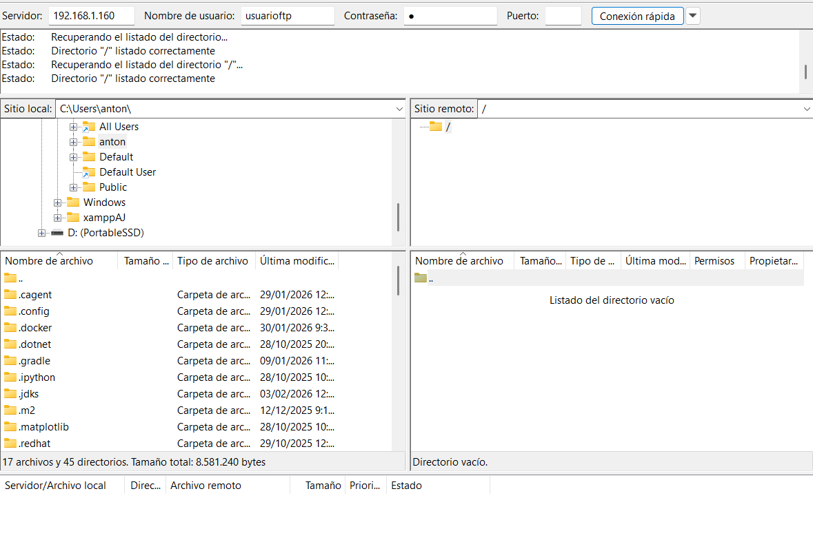

Para poder enviar datos, pondremos lo siguiente
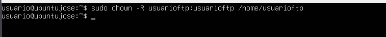

Ahora añadiremos un index al apache, esto lo haremos transfiriendo datos desde nuestro dispositivo al usuario mediante filezilla
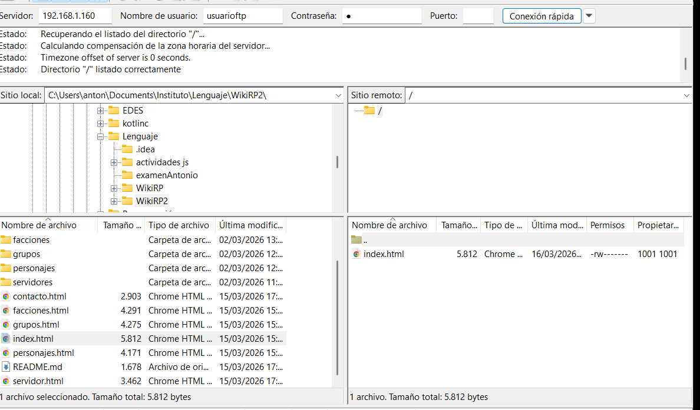

Una vez transferido, volveremos al servidor y pondremos lo siguiente


Y listo, ya habremos cambiado el index, aunque está sin css porque este no lo hemos pasado
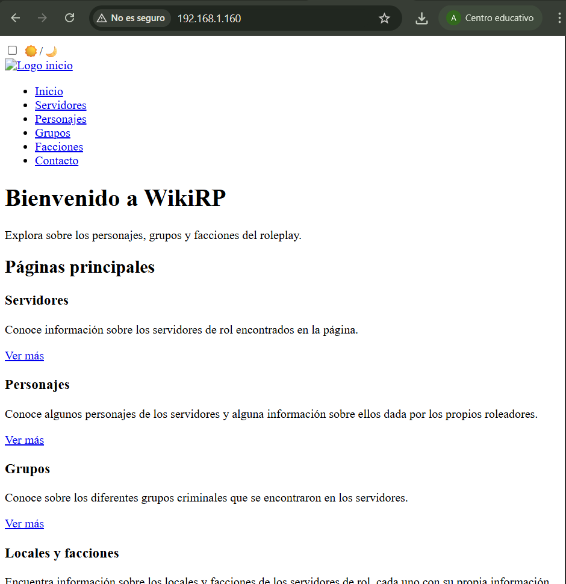